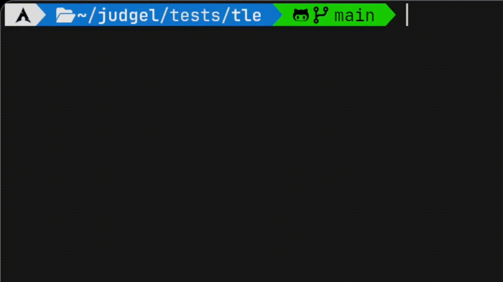

<br />
<div align="center">
  <h1 align="center">Judgel</h3>
  <p align="center">
    ⚖️ Simple local C++ CLI judge
    <br />
    <br />
    <a href="https://github.com/udontur/judgel/issues/new">Report Bug</a>
    ·
    <a href="https://hadrianlau.com">Made with passion by Hadrian</a>
  </p>
</div>

## ⭐ Features
- Command line interface
- Available verdicts:
  1. Accepted
  2. Wrong Answer
  3. Time Limit Exceeded
  4. Runtime Error
  5. Compilation Error
- Simple to install
- Simple to use

## 🛠️ Installation (Linux)
```judgel``` is available via the Nix package manager (```unstable``` branch)
```nix
environment.systemPackages = with pkgs; [
    judgel
];
```

## ⚙️ Prerequisites
1. Testcase folder name: ```testcase```
	- Testcase file format: ```JUD.in``` and ```JUD.out```
2. Code file name: ```main.cpp```

## 🔧 Usage
Run the following command in your **code directory**:
```sh
judgel <TIME LIMIT>
```
> [!IMPORTANT]
> The time limit must be an **integer**.

> [!TIP]
> 1. Leave the time limit blank for a 1 second time limit.
> 2. ```cd /path/to/dir``` to navigate to your code directory

## 💾 Demo

